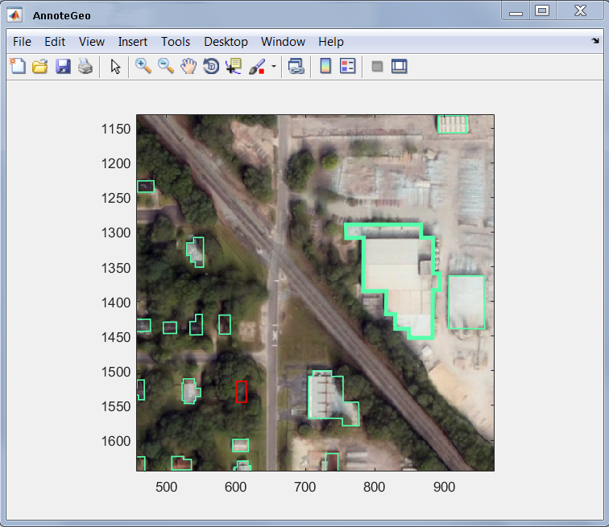
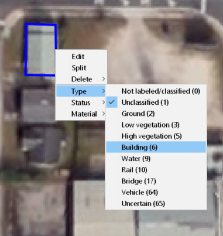
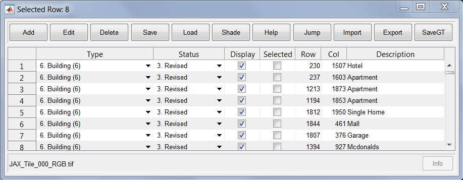
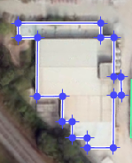
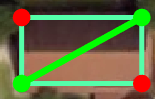
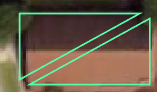
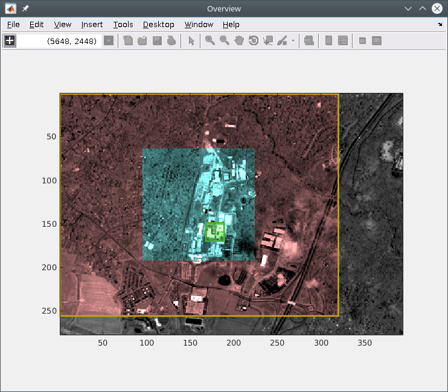
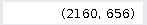
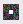

#  Usage
    >> AnnoteGeo
    Start annotation tool with no arguments. User will be prompted with a dialog box to select GeoTIFF image file to label
    
    >> AnnoteGeo(IMAGE_FILE_PATH)
    Start annotation tool using the supplied GeoTIFF filename
    
    >> AnnoteGeo(IMAGE_DIRECTORY)
    Start annotation tool with GeoTIFF file selector at the specified directory 

# Windows
This section of the guide provides documentation of the functionality available to each window
## Annotation Window
This is the main window where annotations are drawn. Annotation drawing utilizes Matlab's roipoly.m. See Matlab help on roipoly for more information. 

Annotations can be updated through the annotation's context menu or using the main data table described below.

## Table Window

| Function | Description |
| -------- | ----------- |
| Add      | Add a new polygon and table entry |
| Edit     | Edit the polygon of currently selected row. The same functionality exists by right-clicking a polygon in the Annotation Window and selecting "Edit". This will show each vertice in the polygon, which are draggable. To finish editing, double click anywhere inside the polygon.          You can also right click and select "Split", which allows you to select two vertices that will separate the selected polygon into two individual polygons.     ->   You can also hold the 'A' key while editing to add vertices to the polygon. |
| Delete   | Delete the entry of currently selected row |
| Save     | Save the current set of annotations. This saves all annotations from the original file, including polygons that were removed due to being outside of the background image bounds. |
| Load     | Load a set of annotations from a previously save MAT-file. If the file has polygons that are outside the background image bounds, they are ignored for faster loading and processing times. However, when saving new/edited annotations, they are put back in to preserve ground truth. If there are already polygons loaded into the tool, they are removed and lost upon loading in new data. Make sure to save any work before loading in new data. |
| Shade    | Shade all of the current polygons |
| Help     | This document |
| Jump     | Jump to annotation of currently selected row |
| Import   | Import ESRI Shapefile |
| Export   | Export annotations to KML |
| SaveGT   | Export GT rasters to PWD. This will export a xxx_GTI.tif, xxx_GTL.tif, and xxx_GTC.tif to the present working directory. This calls on truther2raster.m to create and save these raster products. These are geotiff products that represent ground truth indexed buildings (GTI), ground truth label buildings (GTL), and ground truth color buildings (GTC). The labeling follows the LAS specification |

## Overview Window
This window provides context to the annotation window. It shows an overview of the entire GeoTIFF and provides shading to show current, viewed, loaded regions of the image (i.e. a "snail trail" to help keep track of which parts of the image have already been labeled).

### Window Shading
The colors of the shading provide context to the user. In addition to showing which regions have been previously viewed, image data currently and previously loaded is also indicated.  As the tool employs data buffering to enable support for large images on low resource systems, this information allows the user visual indication of how efficiently the image is navigated and when the user is near the edge of the current image buffer.

| Color  | Status                          |
| ------ | ------------------------------- |
| Green  | Current View                    |
| Blue   | Previously Viewed               |
| Yellow | Currently loaded image buffer   |
| Red    | Previously loaded image buffers |

### Toolbar

| Display                                       | Function |
| --------------------------------------------- | -------- |
|           | Enable crosshair cursor to select location in image to navigate to. |
|  | Displays the pixel location of the cursor in in x,y positions. |
|                | Resets the snail trails. |

## Keyboard Shortcuts
These shortcuts are only applicable on the annotation window

### General

| Buttons            | Action                                                                                 |
| ------------------ | -------------------------------------------------------------------------------------- |
| shift + d          | Delete selected annotation                                                             |
| shift + left-click | Select multiple annotations. Used to apply context menu action to multiple annotations.|
| shift + a 	     | Add new annotation                                                                     |
| F1 .. FX           | Add new annotation of #th category                                                     |
| up-arrow or e 	 | PAN UP                                                                                 |
| down-arrow or d    | PAN DOWN                                                                               |
| left-arrow or s    | PAN LEFT                                                                               |
| right-arrow f      | PAN RIGHT                                                                              |
| r                  | ZOOM IN                                                                                |
| w                  | ZOOM OUT                                                                               |
| shift + w          | ZOOM RESET                                                                             |
| ESC                | Reset drawing state (If Add button stops working, this may help)                       |

### Contrast Adjustment 
Only available for single channel data

| Buttons | Action                             |
| ------- | ---------------------------------- |
| ~       | Reset color axis                   |
| 1       | Decrease lower limit of color axis |
| 2       | Increase lower limit of color axis |
| 3       | Decrease upper limit of color axis |
| 4       | Increase upper limit of color axis |
